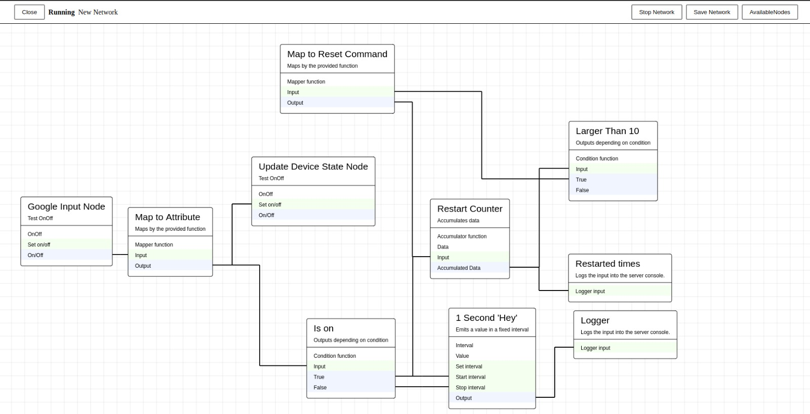

# Ada Core

> General automation tool

### [Documentation](./docs/)

Example:

### TODOs

- Handle missing Connectors
    - Missing during network start
    - Timout during network start
    - Reappearing while network is running
- Merge Client and Editor
    - Proper data management
    - proper integration into core
- @ada/lib
    - Build & Tests
    - RabbitMQ Config

### Connectors

- WIP: Google Assistant
- WIP: Whatsapp
- WIP: Tuya / Smart Life